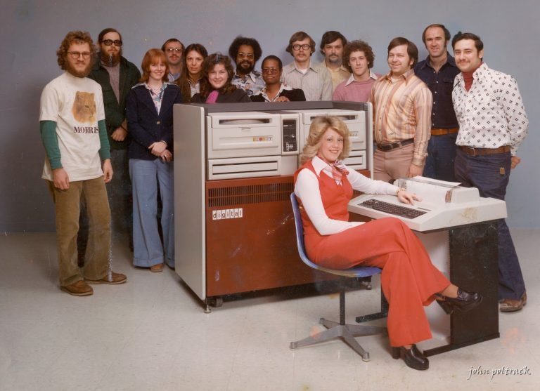

# CSC3510-Spring-2024

This document serves as both the course's syllabus and its main web
page.

## About the Professor

Professor Perry Kivolowitz has retired from full time teaching after 19
years (ten at UW-Madison and nine at Carthage College). They continues
to teach two highly specialized courses at Carthage: CSC4730 - Operating
Systems and CSC3510 - Computer Organization.

In addition to their years in academia, Professor Kivolowitz enjoyed a
more than 40 year career as an entrepreneur and inventor mostly in the
field of digital visual effects for motion pictures and television. They
have been awarded with two Emmy Awards and an Academy Award for their
inventions.

The digressions they will make constitute significant value. Professor
Kivolowitz has had a passion for Computer Science for 50 years, long
enough to posses **lived** experience from the late dawn / early
adolescence of computing.

*So pay attention and let Grandpa rant.*

## Course Overview and Introduction

This course is entitled Computer Organization. This classically suggests
we'll start with *and* and *or* logic gates and build our way up to a
simple computer. This is fine if you are going to be an EE. Electrical
engineering is not the focus of this Computer Science program. Software
excellence is.

This course presents Computer Organization from the perspective of an
astute and sagacious software developer. More deeply, this course is
about software excellence. By stressing assembly language, the harshest
and most unforgiving of languages, you'll learn patience, diligence,
perseverance and **discipline**.

It's one thing to develop software while sipping a Venti Iced Caramel
Macchiato made with Blonde Espresso Upside Down 1/2 Vanilla Syrup 1/2
Dark Caramel Syrup Topped with Salted Caramel in beautiful Stratos,
Elysium or Zalem.

It's another thing to code on Crematoria, LV-426 or Ceti Alpha V. By
understanding the intimate interplay between hardware and software in an
unforgiving environment, you are more likely to outshine your
post-Carthage competition.

### This is a Required Course

You cannot complete the CS program at Carthage College without achieving
a grade of C- or better. This is a very low bar. In my view it should
require a B or better. Do you want the coder of the avionics software of
the plane your family is riding in to be written by a C- coder? How
about Paw Paw's pacemaker? You want a C- student writing that code?

## Course Objectives and Outcomes

As stated above, this course presents Computer Organization from the
perspective of the *astute* and *sagacious* software developer.

As a result of taking this course you will be:

* proficient and knowledgeable of the ARM V8 64-bit ISA (Instruction Set
Architecture).

* knowledgeable of the ramifications of choices that you make in higher
level languages on the performance of the resulting system.

* knowledgeable of number formats and operations.

* knowledgeable of bit oriented operations.

* able to discern the effect of CPU specifications upon performance with
understanding of the parts of a CPU.

* able to discern the effect of computer specifications upon performance
with understanding of components like buses, memory and storage devices.

## Meetings and Office Hours

All meetings and office hours are virtual. These are held here:

[Zoom
Link](<https://carthage-edu.zoom.us/j/94497021922?pwd=eWc4U0lSb0FWSElsVUt4cTQ4YkNEdz09>)

Class Meetings:

| Days | Times |
| ---- | ----- |
| TR | 2:20 PM to 4:00 PM |

Office Hours:

| Day | Times |
| --- | ----- |
| M | 11 AM to 12 PM |
| T | 11 AM to 12 PM |
| BBQ | 7 PM to 9 PM |
| F | 12 PM to 1 PM |

The Day "BBQ" coincides with whatever day the BBQ is to be held on.

Office hours may be recorded if the content is deemed by me to be of
general use to the class.

### Meetings / Questions outside of office hours

Due to abuse of the instructor's time during Spring 2023, help shall be
largely limited to the above hours. Make sure you ask your questions
during class or during posted office hours.

### Meetings / Questions prior to project due dates

With some exceptions, to be decided by me, help on projects will not be
available within 24 hours of a project's due date. This prohibition is
imposed to encourage good working habits including but not limited to
starting work early / working steadily. This is not intended punitively.

Help will always be available during office hours that coincide with the
weekly BBQ.

## Texts

Primary: [My Assembly Language
Book](https://github.com/pkivolowitz/asm_book) This book is free and a
work in progress.

Ancillary (These are listed in order of usability / importance):

0. [Cheat Sheet](./arm64cheatsheetedited.pdf) highlighted sections
include a superset of what we will cover in class with little exception.

1. [ARM V8-A Reference
   Manual](<https://github.com/pkivolowitz/asm_book/blob/main/reference_material/armv8_arm.pdf>)

2. [ARM V8-A
   ISA](<https://github.com/pkivolowitz/asm_book/blob/main/reference_material/Armv8-A%20Instruction%20Set%20Architecture.pdf>)

3. [Load Linked Store
   Condition](<https://github.com/pkivolowitz/asm_book/blob/main/reference_material/USENIX2020.pdf>)

4. [ARM Scalable Vector
   Extension](<https://github.com/pkivolowitz/asm_book/blob/main/reference_material/sve-ieee-micro-2017.pdf>)

## Readings

There are no assigned readings in this class. Grandpa's not spoon
feeding you by telling you what to read and when. I *will* often make
suggestions. Take these suggestions seriously. Not assigning reading is
intended to mimic real life as a software developer. Nobody holds your
hand. Preparing you for your post-Carthage life is appropriate for this
level of course.

You expected to have consulted the texts before approaching me with
questions. If I should answer something to the effect that the answer is
in the book, you are expected to explain to me what you read and
articulate what you found unclear. This step is take to encourage good
working habits on your part and is not punitive.

## Recordings

* [2/1/2024](https://carthage-edu.zoom.us/rec/share/gCGnpDD7wPHVZNwrTVYeSL_Yhsr1ci4nUyF2iasgwqrgVGV7D3hJnfKyDNktwvRS.xzYQFui2EmpOi-F1)

* [2/6/2024](https://carthage-edu.zoom.us/rec/share/jeWWdec_RS-JX6ZuPMK8YdkRQZUo9xRQvFsHrzNRkf-bS8I6avcCyDuvBKVKDkQR.LAfLeQMoBtaKROue)

* [2/8/2024](https://carthage-edu.zoom.us/rec/share/Bm_j5eDSAUS85gWwy3IdjhofplWwiyeIwtpJ6wnYhBvAzLmDih3naWtOHn4U0QJm.uOmNsmS6-a_MebJP)
  
### Topics Covered

The following are the topics which we can expect to be covered. This
list may be incomplete and specific items on the list may be omitted
subject to class pace.

* ARM V8 ISA

  * Basic Instructions

  * Addressing Modes

  * Integer Math Instructions

  * Floating Point Math Instructions

  * Conditional Instructions

  * Branch Instructions

  * Branch With Link

  * Synchronization Instructions

* Registers Including Some Special Registers

* Implementation of Control Structures

  * if, if / else, if / else if

  * while, for, do / until

  * switch

* `struct`

* arrays

* Function Calls and Argument Passing

* Variadic Functions

* System Calls

* Cache Memory Systems

* Rotating Disc Systems and Maybe, SSDs

* RAID Architectures

* Bus Systems

* Binary, Octal and Hexadecimal

* Integers, Two's Complement Arithmetic

* IEEE 754 Floating Point Numbers

* Bitwise Operations

  * in ARM V8

  * in C and C++

  * Bit Bashing

## Environment

Our programming environment is a Linux ARM distribution. It is required
on both Windows and Macintosh (even if you have an ARM-based Macintosh
or a rare ARM-based Windows machine).

The installation guide is found [here](<./install.md>).

Note, if you are on an ARM Windows machine, let me know. I'd like to
know how and where you got it. I have the Microsoft ARM Development
machine, myself. I like it but you will have to use WSL as the API we
are using is Linux.

## Attendance

Attendance will be taken at nearly every class. The only exceptions will
be when I am so excited to get down to business, that I forget to take
it.

You get 6 free absences. After that each absence will remove 2 (two)
percent from your aggregate score at the end of the term.

*All absences are treated equally. That is, there are no "excused"
absences.*

The number of free absences equates to three weeks of missed class time
so it is unlikely you'll exceed this and incur a penalty.

Should a *long-term* absence due to uncontrollable circumstances become
necessary, please speak to me as soon as possible.

## Arriving Late

Anyone arriving after attendance has been completed will be counted as
absent. Generally, attendance will end between ten to fifteen minutes
after the official start of class. Do not depend upon this estimate
because it will vary from class period to class period.

## Leaving Early

No, your coach cannot force you to leave class early to make practice.
This comes directly from the current Athletic Director. 

If you are friends with persons arriving at practice before 4 PM, they
do not have late afternoon classes or are choosing to put their
extra-curricular sports ahead of the **REST OF THEIR LIVES**.

## Warmups

There are two warmup exercises that are graded and are included in your
final score.

The first is an essay. It is already assigned and is due 2/1/2024 at
11:59 PM.

The second is to be completed after you install the environment we will
be using. The exercise is simply to modify some source code which is
supplied to you, build it, run it, take a screen shot of it. Submit the
screen shot. This is already assigned as is due on 2/8/2024.

### Essay

You will be required to write an essay as part of class. It is found
[here](./essay.md).

### Build Code

See the [install](./install.md) guide and then the [warmup
specification](./warmup/README.md).

## Projects

Below is a listing of some number of projects.

The *Weight* column provides a weighting of the project within the
Project Grading Component. It suggests my anticipation of the *relative*
difficulty of each project compared to the others.

Projects contribute 82 percent of your final grade.

| # | Project                             | Weight  | Partner |
| - | -------                             | ------: | ------- |
| 1 | Read a Byte, Write a Byte           | 60      | No      |
| 2 | Sorted Singly Linked List           | 80      | No      |
| 3 | Tail                                | 80      | Yes     |
| 4 | Cosine Using Taylor Series          | 70      | No      |
| 5 | NEON Intrinsics                     | 70      | No      |
| 6 | memcpy                              | 80      | Yes     |

### Project Partners

Choose whom you like to partner with for those projects which are
partner projects. A project is a partner project if it says so above.

Please get over partnering with losers. You know, that friend of yours
who has been riding your skills, knowledge and work effort all through
college.

**Let the losers lose.**

Better they learn this lesson now then get fired later or worse: injure
or kill someone because of their incompetence.

Partners get the same grade. If your partner ducks up, it's a **you**
problem. See above.

### Project Requirements

* Requirements are spelled out in each specification.

* Any deviation from the specification likely results in penalties.

* Generating even a single warning during building your code will result
  in a 10 percent penalty.

* Commenting is required. Failure to adequately comment is a mandatory 5
  percent penalty.

### Project Grace Days

All projects get one grace day, no questions asked.

### No Late work apart from grace days

**Late work (factoring in one free grace day) will not be accepted.**

To state this differently, if an assignment is due on day *n*, you have
until the end of day *n + 1* to turn it in. After that, it will not be
accepted.

I award partial credit for substantial but incomplete work. This is
unlike the real world where incomplete work earns termination of your
employment. Hand in what you have... it's better than a zero.

## Grading Components

| Gradable Component | Weight  | Notes   |
| ------------------ | ------: | -----   |
| Attendance         | 10      |         |
| Warmups            |  3      |         |
| Essay              |  5      |         |
| Projects           | 82      |         |

There is very little likelihood a curve will be applied in computing
your final grade.

## Accommodations

There are no exams in this course and projects already include a grace
day. Therefore, no significant accommodations ought to be necessary but
present your papers to me at the start of the semester anyway. We'll
discuss what should be done.

## Health and Counseling Center

The Health and Counseling Center (HCC) addresses student physical,
mental, and emotional well-being. All services, provided by experienced
professionals, are free and confidential to currently enrolled,
full-time undergraduate students. Students must call or visit the HCC to
schedule an appointment. Health services are available by walk-in or
appointment from 8:30am - 3:30pm. Counseling walk-in sessions are
available Monday through Friday from 11:30am to 1:00pm, last appointment
begins around 12:30pm, first-come first-seen. TWC, first floor(behind
mailboxes)| 262-551-5710 | Website | Mon-Fri 8:30am to 1pm and 2pm to
4:00pm.

## Learning Accessibility Services

Carthage College strives to make all learning experiences as accessible
as possible. If you anticipate or experience academic barriers due to
your disability (including mental health, learning disorders, and
chronic medical conditions), please let me know immediately so we can
discuss options privately.  To establish reasonable accommodations, you
must register with Warren Wolchuk in Learning Accessibility Services
[wwolchuk@carthage.edu](wwolchuk@carthage.edu).

## Academic Honesty

All work will be examined for originality. Should I find evidence of
copied work, all parties shall receive a grade of zero. If any
individuals are found to have copied a second time, the individuals will
be reported to the Provost's office for discipline and will receive a
zero for the assignment. Should an individual be associated with a third
instance, in addition to a second trip to the Provost, the individual
shall receive an F in the course.

The decision of the instructor is final.

## General statement about "help"

Apart from lecture, I will not "just give you the answer." Rather, you
must demonstrate that you have exhausted the means available to you to
learn on your own. This is not punitive. This will be a requirement for
your future. You'll get in the habit now. This may be a lasting and
meaningful "gift" to you from me.

### Jishnu Mukerjee, Senior Systems Architect at Hewlett-Packard

<figure>
  
  <figcaption style="width:40%;">Jishnu Mukerji</figcaption>
</figure>

When I was an undergraduate, Jishnu Mukerjee was the graduate student
who was in charge our department's
[PDP-11/60](<https://en.wikipedia.org/wiki/PDP-11>). It ran an early
version of Unix, V6 to be exact.

<figure>
  
  <figcaption style="width:100%;">A representative image of a
  PDP 11/60 with two RK05 (2.5 megabyte) hard disk drives and an LA120
  console. My CS Department received an RK05 disk pack from Ken Thompson
  in the mail with a hand written note on it. "Here's you Unix
  distribution. Love, Ken". The Department also had a DecTape</figcaption>
</figure>

The first time I had a question, I asked Jishnu and he answered it.

The second time I had a question, I asked Jishnu and he answered it.

The third time I had a question, I asked Jishnu and he handed me a print
out of the entire OS. He said, "All your answers are in here."

It was the greatest gift he could possibly give and I am thankful to him
to this day.
